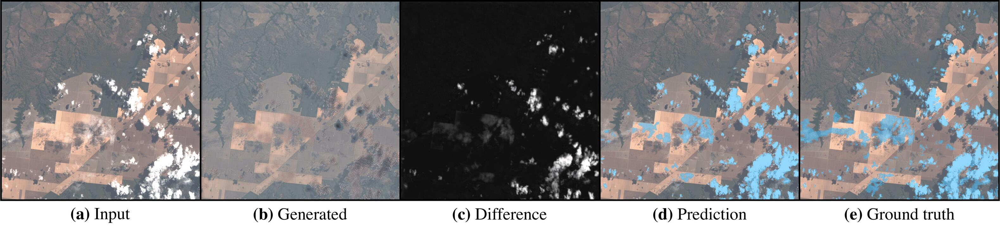

# FCD: Fixed-Point GAN for Cloud Detection

PyTorch source code of [Nyborg & Assent (2020)](https://arxiv.org/abs/2111.11879).

## Abstract
The detection of clouds in satellite images is an essential preprocessing task for big data in remote sensing. Convolutional neural networks (CNNs) have greatly advanced the state-of-the-art in the detection of clouds in satellite images, but existing CNN-based methods are costly as they require large amounts of training images with expensive pixel-level cloud labels.
To alleviate this cost, we propose Fixed-Point GAN for Cloud Detection (FCD), a weakly-supervised approach. 
Training with only image-level labels, we learn fixed-point translation between clear and cloudy images, so only clouds are affected during translation. Doing so enables our approach to predict pixel-level cloud labels by translating satellite images to clear ones and setting a threshold to the difference between the two images.
Moreover, we propose FCD+, where we exploit the label-noise robustness of CNNs to refine the prediction of FCD, leading to further improvements.
We demonstrate the effectiveness of our approach on the Landsat-8 Biome cloud detection dataset, where we obtain performance close to existing fully-supervised methods that train with expensive pixel-level labels. By fine-tuning our FCD+ with just 1\% of the available pixel-level labels, we match the performance of fully-supervised methods.


## Dependencies
To setup a conda environment named `fcd` with all dependencies installed, run 

```
conda env create -f environment.yml
conda activate fcd
``` 

This will install the following packages:
```
tqdm
opencv-python
rasterio
tifffile
pillow
matplotlib
pytorch
torchvision
cudatoolkit
tensorboard
albumentations
sklearn
segmentation-models-pytorch
```

## Usage
To download the full Landsat-8 Biome dataset (96 Landsat-8 scenes, about 182 GB when extracted), run
```
python download_landsat8_biome.py
```

To prepare 128x128 patches with image-level labels for training, run
```
python prepare_landsat8_biome.py 
```

### Train FCD
To train Fixed-Point GAN for Cloud Detection (FCD), run
```
python main.py --mode train --dataset L8Biome --image_size 128 --batch_size 16 --experiment_name FCD
```

You can monitor the training progress by starting TensorBoard for the `runs` dir:
```
tensorboard --logdir=runs
```


### Train FCD+
When FCD is trained, we can generate pixel-level cloud masks for the training dataset by running
```
python main.py --mode generate_masks --batch_size 64 --experiment_name FCD
```
This will generate cloud masks for the Landsat-8 scenes in the training dataset, and save them in `outputs/FCD/results/tifs`. 
Then, to divide these cloud masks into the corresponding patches for training, we can run
```
python prepare_landsat8_biome.py --generated_masks outputs/FCD/results/tifs
```
resulting in a `generated_mask.tif` in addition to the ground truth `mask.tif` for every training patch.

Then, to train FCD+ with `generated_mask.tif` as targets, run
```
python supervised_main.py --mode train --batch_size 64 --train_mask_file generated_mask.tif \
                          --classifier_head True --experiment_name FCD+
```

Finally, to fine-tune the resulting model on 1% of actual pixel-wise ground truth, run
```
python supervised_main.py --mode train --batch_size 64 --keep_ratio 0.01 --lr 1e-5 --freeze_encoder True \
                          --model_weights outputs/FCDPlus/models/best.pt \
                          --experiment_name FCD+1Pct 
```

### Train models compared with in paper
See the bash scripts in the `scripts` folder for the exact runs done in the paper.


# Citation
If you find our work useful for your research, please cite our [paper](https://arxiv.org/abs/2111.11879):
```
@inproceedings{nyborg2021fcd,
  author={Joachim Nyborg and Ira Assent},
  title={Weakly-Supervised Cloud Detection with Fixed-Point GANs}, 
  booktitle={2021 {IEEE} International Conference on Big Data (Big Data)},
  pages={4191--4198},
  publisher={{IEEE}},
  year={2021},
  doi={10.1109/BigData52589.2021.9671405}
}
```


# Acknowledgements
This repository is based on [mahfuzmohammad/Fixed-Point-GAN](https://github.com/mahfuzmohammad/Fixed-Point-GAN) and [yunjey/stargan](https://github.com/yunjey/stargan).


